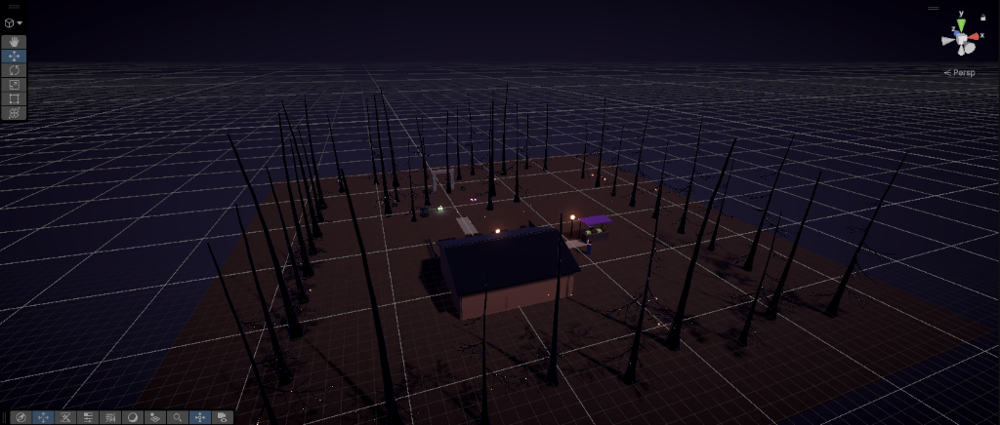

# VENEFICA — Quality Assurance & Playtest Documentation

Quality Assurance (QA) and playtest documentation for **VENEFICA** (Milestone M1 Prototype), covering master test plan, modular test suites, defect tracking reports, smoke checklists, and an Excel master workbook.



---

## Repository Structure

```
ENG_VER/
├── Test_Plan/
│   └── TEST_PLAN.md                # Master QA Test Plan (Scope, Strategy, Exit Criteria)
├── Test_Suites/
│   ├── 01_Player_Movement_and_Camera.md    # WASD, Sprint, Camera collision & Occlusion
│   ├── 02_Interaction_and_Targeting.md      # E-key targeting & wall-obstruction check
│   ├── 03_NPC_Dialogue_System.md            # Lina & Rowan dialog trees, input modal
│   ├── 04_Foraging_and_World_Nodes.md       # Moonleaf harvesting & anti-duplication
│   ├── 05_Quest_and_Economy.md              # Quest turn-in, Gold economy, single-reward
│   ├── 06_Inventory_and_Modal_HUD.md        # Tab Bag, text auto-sizing & movement lock
│   └── 07_Workstation_Inspection.md         # Alchemy bench camera zoom & plot inspect
├── Defect_Reports/
│   └── BUG_REPORTS.md              # Bug log, resolved defects, and open limitations
└── Checklists/
    └── M1_SMOKE_CHECKLIST.md       # 20-point rapid playtest verification checklist
```

---

## Milestone M1 Testing Summary
- **Total Functional Test Cases:** 20 Scenarios across 7 Modular Test Suites
- **Smoke Checklist Pass Rate:** 100% (20 / 20 Scenarios Passed)
- **Critical Defects:** 0 Open Blocker Bugs
- **Core Systems Validated:** Locomotion, Third-Person Camera, Dialogue Trees, Foraging, Economy Exchange, and Workstation Inspection.

---

## Quick Links & References
- [Master Test Plan](Test_Plan/TEST_PLAN.md)
- [Defect Tracking Reports](Defect_Reports/BUG_REPORTS.md)
- [Playtest Smoke Checklist](Checklists/M1_SMOKE_CHECKLIST.md)
- [Excel QA Workbook](../Workbook/VENEFICA_QA_Workbook.xlsx)

