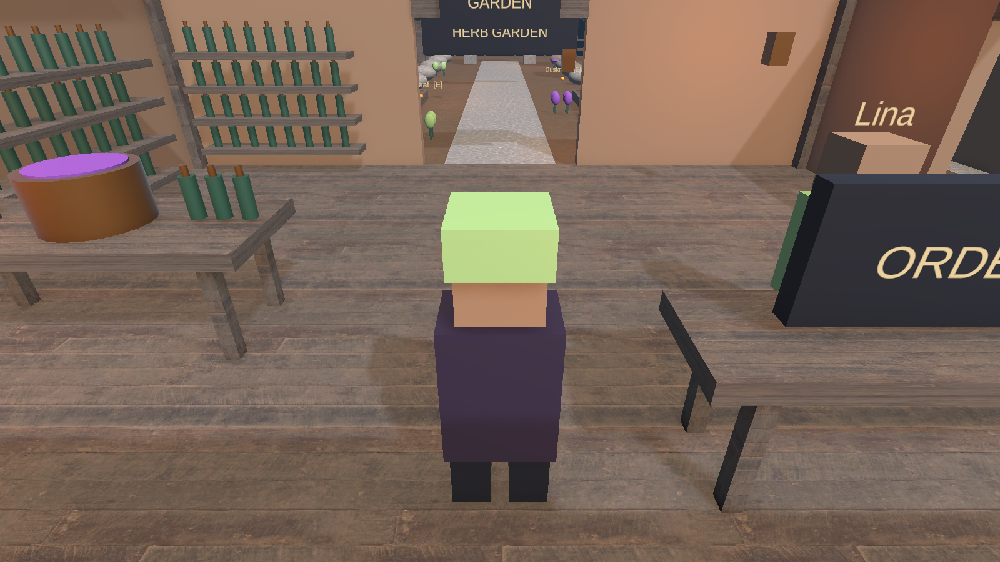
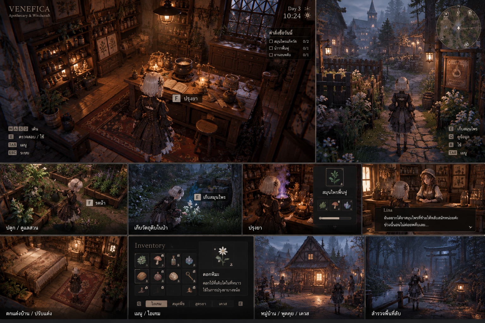
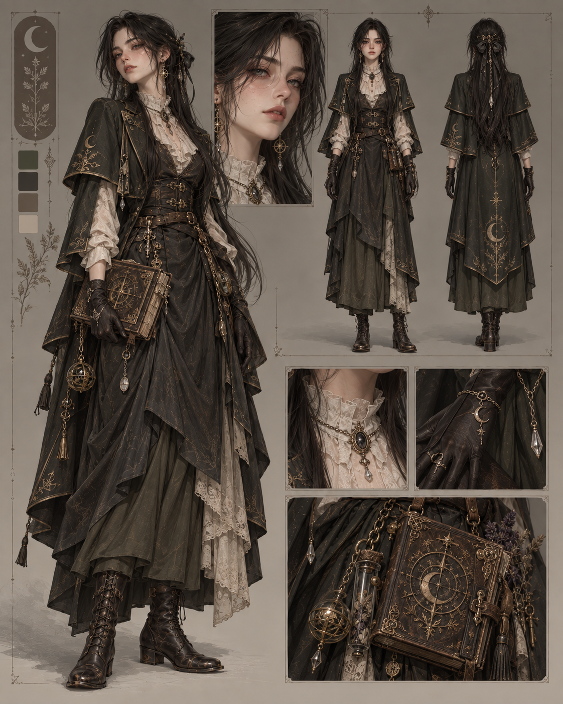

# VENEFICA — Quality Assurance & Game Testing

[](https://unity.com/)
[](https://unity.com/)
[](https://microsoft.com)
[]()
[-orange.svg)]()

Quality Assurance (QA) and game testing documentation for the **VENEFICA** prototype (Milestone M1). Contains bilingual test plans, modular test suites, defect tracking reports, playtest smoke checklists, and an Excel master workbook.

---

## 🌐 Choose Documentation Language / เลือกภาษาของเอกสาร

| [🇬🇧 English Version (ENG_VER)](ENG_VER/README.md) | [🇹🇭 ฉบับภาษาไทย (THAI_VER)](THAI_VER/README.md) |
|---|---|
| Complete English QA documentation, test plans, modular test suites, and defect reports. | เอกสาร QA ภาษาไทยเต็มรูปแบบ แผนการทดสอบ ชุดทดสอบรายระบบ และบันทึกรายงานบัค |
| 👉 **[Enter English QA Docs](ENG_VER/README.md)** | 👉 **[เข้าสู่เอกสารภาษาไทย](THAI_VER/README.md)** |

---

## 🎮 Game Concept & In-Game Visual Evidence

### Key Gameplay & Prototype Environment
The prototype slice features an interconnected hub including the Witch's Alchemical Shop, customer service counter, back garden beds, marketplace stalls, and an ancient stone archway leading into the deep forest grove.

| In-Game Overview Capture | In-Game Third-Person Perspective |
|:---:|:---:|
|  |  |
| *Top-down view of shop interior, garden plots, market, and grove trails.* | *Player perspective with interaction prompts and dialogue HUD.* |

| Key Visual Concept | Character Design |
|:---:|:---:|
|  |  |
| *Atmospheric visual target for gothic witch shop.* | *Character concept art.* |

---

## 📁 Repository Directory Map

```
VENEFICA-Game-Testing/
├── Media/                               # In-engine screenshots & concept art
│   ├── Prototype_Overview.png
│   ├── Prototype_PlayerView.png
│   ├── Concept_Main.png
│   ├── Character_Concept_01.png
│   └── Character_T_Pose_01.png
│
├── ENG_VER/                             # English QA Documentation
│   ├── README.md                        # English landing & index
│   ├── Test_Plan/
│   │   └── TEST_PLAN.md                 # Master QA Test Plan (M1 Slice)
│   ├── Test_Suites/
│   │   ├── 01_Player_Movement_and_Camera.md
│   │   ├── 02_Interaction_and_Targeting.md
│   │   ├── 03_NPC_Dialogue_System.md
│   │   ├── 04_Foraging_and_World_Nodes.md
│   │   ├── 05_Quest_and_Economy.md
│   │   ├── 06_Inventory_and_Modal_HUD.md
│   │   └── 07_Workstation_Inspection.md
│   ├── Defect_Reports/
│   │   └── BUG_REPORTS.md               # Defect metrics & resolved bug log
│   └── Checklists/
│       └── M1_SMOKE_CHECKLIST.md        # 20-point playtest verification checklist
│
├── Workbook/                            # Master QA Spreadsheet (Excel)
│   └── VENEFICA_QA_Workbook.xlsx        # Multi-tab test plan, suites, bug log & checklist
│
└── THAI_VER/                            # Thai QA Documentation (ฉบับภาษาไทย)
    ├── README.md                        # หน้าแรกและสารบัญฉบับภาษาไทย
    ├── Test_Plan/
    │   └── TEST_PLAN.md                 # แผนการทดสอบหลัก
    ├── Test_Suites/
    │   ├── 01_Player_Movement_and_Camera.md
    │   ├── 02_Interaction_and_Targeting.md
    │   ├── 03_NPC_Dialogue_System.md
    │   ├── 04_Foraging_and_World_Nodes.md
    │   ├── 05_Quest_and_Economy.md
    │   ├── 06_Inventory_and_Modal_HUD.md
    │   └── 07_Workstation_Inspection.md
    ├── Defect_Reports/
    │   └── BUG_REPORTS.md               # รายงานบันทึกบัคและข้อผิดพลาด
    └── Checklists/
        └── M1_SMOKE_CHECKLIST.md        # เช็กลิสต์ทดสอบความพร้อมเกมเพลย์ 20 ข้อ
```

---

## 📊 Master QA Workbook (Excel)
A structured spreadsheet companion is available for project management and test tracking:
- 📁 **[Workbook/VENEFICA_QA_Workbook.xlsx](Workbook/VENEFICA_QA_Workbook.xlsx)**
  - Tab 1: `Overview & Test Plan` (Scope, test metadata, subsystem pass/fail metrics)
  - Tab 2: `Test Suites (ENG)` (All 20 test cases with preconditions, steps, expected results)
  - Tab 3: `Test Suites (THAI)` (ทุกชุดการทดสอบฉบับภาษาไทย 20 ข้อ)
  - Tab 4: `Defect Log` (DEF-01 to DEF-04 resolved bugs + LIM-01 to LIM-02 limitations)
  - Tab 5: `Smoke Checklist` (20-point fast verification checklist)

---

## 📊 Summary of Quality Assurance Results (Milestone M1)

| Area Tested | Scope & Key Verifications | Result |
|---|---|:---:|
| **Locomotion & Camera** | WASD movement, Shift sprint, SphereCast wall collision protection | **PASS** |
| **Object Interaction** | Trigger radius, line-of-sight checks (rejects through-wall actions) | **PASS** |
| **NPC Dialogue** | Lina shopkeeper & Rowan merchant dialog trees, `Esc` dismiss | **PASS** |
| **Foraging & Harvesting** | Moonleaf collection, "Leave it growing" state check, anti-duplication | **PASS** |
| **Quest & Currency** | Turn in 3 Moonleaf -> +10 Gold (40 -> 50), anti-repeat reward check | **PASS** |
| **Inventory & Menus** | `Tab` bag screen, dynamic font auto-sizing (18-23pt), input lock during UI | **PASS** |
| **Workstation Inspection** | Alchemy table camera zoom, note inspection, smooth camera release | **PASS** |

---

## 🛠️ Key Resolved Defects
1. **Camera Occlusion on Spawn:** Resolved camera clipping into the front sign/wall using `SnapToPlayer()` with SphereCast distance clamping.
2. **Missing Prefab Connection:** Fixed player-session reference loss by enforcing persistent prefab serialization.
3. **Dialogue Text Overflow:** Fixed multi-line text clipping by activating dynamic font auto-sizing (18–23pt).
4. **Through-Wall Interaction:** Added raycast line-of-sight check to block interactions through solid building walls.
